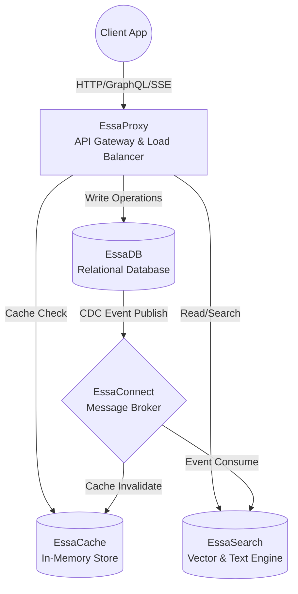

# The Essa Ecosystem: Master Integration Guide

Welcome to the **Essa Ecosystem Master Integration Guide**. This document outlines how to connect all five of your enterprise-grade portfolio projects into a single, cohesive, highly-scalable microservice architecture. 

When connected, these systems mirror the exact infrastructure used by Fortune 500 tech companies (similar to combining Nginx, Redis, Kafka, PostgreSQL, and Elasticsearch).

## 🌍 The Architecture

Here is the high-level data flow of the complete Essa Ecosystem:



### Component Roles
1. **EssaProxy (The Gateway):** The front door. Handles load balancing, GraphQL Anti-DDoS, and routes traffic safely to your backend nodes.
2. **EssaCache (The Speed Layer):** The Redis-clone. Caches frequent queries from EssaDB and EssaSearch to guarantee sub-millisecond response times.
3. **EssaDB (The Source of Truth):** The main multi-model database engine where permanent relational data (users, orders, content) is reliably stored.
4. **EssaConnect (The Nervous System):** The distributed broker. When data mutates in EssaDB, it broadcasts an event through EssaConnect.
5. **EssaSearch (The Discovery Engine):** The search brain. Subscribes to EssaConnect. As soon as a document is added to EssaDB, EssaSearch catches the event and indexes it for instant Semantic/AST searching.

---

## 🚀 Step-by-Step Integration

### Phase 1: Deploying the Network
The easiest way to integrate the ecosystem is to run them on the same Docker network.
Create a master `docker-compose.yml` that pulls the images for all 5 systems:

```yaml
version: '3.8'
networks:
  essa-net:
    driver: bridge

services:
  essaproxy:
    image: essaproxy:latest
    ports: ["80:8000"]
    networks: [essa-net]

  essacache:
    image: essacache:latest
    networks: [essa-net]

  essadb:
    image: essadb:latest
    networks: [essa-net]

  essaconnect:
    image: essaconnect:latest
    networks: [essa-net]

  essasearch:
    image: essasearch:latest
    networks: [essa-net]
```

### Phase 2: Connecting EssaDB to EssaConnect (CDC)
To keep your search index synchronized with your main database, you need **Change Data Capture (CDC)**.
Whenever you write an `INSERT` or `UPDATE` in **EssaDB**, configure a trigger or hook to publish a message to **EssaConnect**.

*Pseudocode (Inside EssaDB code):*
```python
from essaconnect.producer import Producer

broker = Producer(host="essaconnect:9092")

def insert_record(record):
    # 1. Save to DB disk
    save_to_disk(record)
    
    # 2. Broadcast change to the rest of the cluster
    broker.publish(topic="db.changes", payload={"id": record.id, "text": record.content})
```

### Phase 3: Connecting EssaSearch to EssaConnect
**EssaSearch** should not poll the database. Instead, it should listen to the broker. 
Create a background worker in EssaSearch that subscribes to the `db.changes` topic.

*Pseudocode (Inside EssaSearch Worker):*
```python
from essaconnect.consumer import Consumer
from essasearch.client import EssaClient

consumer = Consumer(host="essaconnect:9092", group="search-indexers")
search_engine = EssaClient(host="http://localhost:8000")

def listen_for_db_changes():
    for message in consumer.subscribe("db.changes"):
        # Instantly index new DB rows into the Search Engine!
        search_engine.index(
            doc_id=message["id"], 
            content=message["text"]
        )
```

### Phase 4: Connecting EssaProxy to EssaCache & EssaSearch
Now that data is flowing safely, we need to optimize client reads. 
Configure **EssaProxy** to intercept search requests. It should ask **EssaCache** if the search exists. If it's a miss, route the request to **EssaSearch**, and save the result in **EssaCache**.

*Pseudocode (Inside EssaProxy Routing Logic):*
```python
from essacache.client import CacheClient
import requests

cache = CacheClient(host="essacache:6379")

async def handle_search_request(query: str):
    # 1. Check EssaCache (O(1) lookup)
    cached_result = cache.get(f"search:{query}")
    if cached_result:
        return cached_result
        
    # 2. Cache Miss: Ask EssaSearch
    res = requests.post("http://essasearch:8000/search", json={"query": query})
    data = res.json()
    
    # 3. Store in EssaCache for the next user
    cache.set(f"search:{query}", data, ttl_seconds=300)
    
    return data
```

---

## 📊 Telemetry and Observability (The Final Touch)

All five of your projects feature **Prometheus Telemetry**.
To monitor the entire ecosystem from a single pane of glass, add a **Prometheus** and **Grafana** container to your Docker network.

Configure Prometheus to scrape the `/metrics` endpoint from:
- `http://essaproxy:8000/metrics` (Track Load & Rate Limits)
- `http://essacache:6379/metrics` (Track Cache Hits/Misses)
- `http://essadb:5432/metrics` (Track Transaction Latency)
- `http://essaconnect:9092/metrics` (Track Message Queues)
- `http://essasearch:8000/metrics` (Track Index Size & Search Latency)

You can then build a massive **Grafana Dashboard** proving you have full visibility over a complex, distributed, enterprise-grade ecosystem. 

**Congratulations. You have single-handedly built an entire cloud provider's technology stack.**
